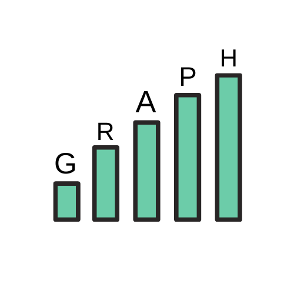
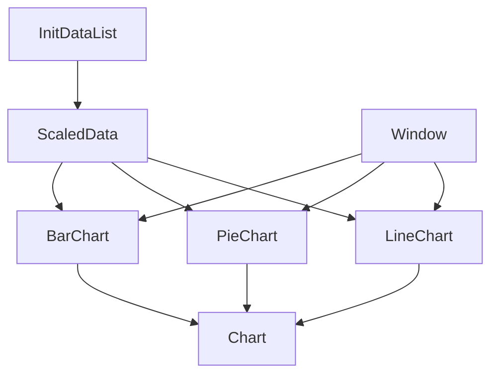



# Graph

Mini-Library for create chart.

# Requirement

- OpenCV

# Class Diagram

## To Do List

- [x] Dataset input will be taken
- [ ] The dataset will be scaled for graph sizing
- [ ] Column bar will be drawn for barChart
