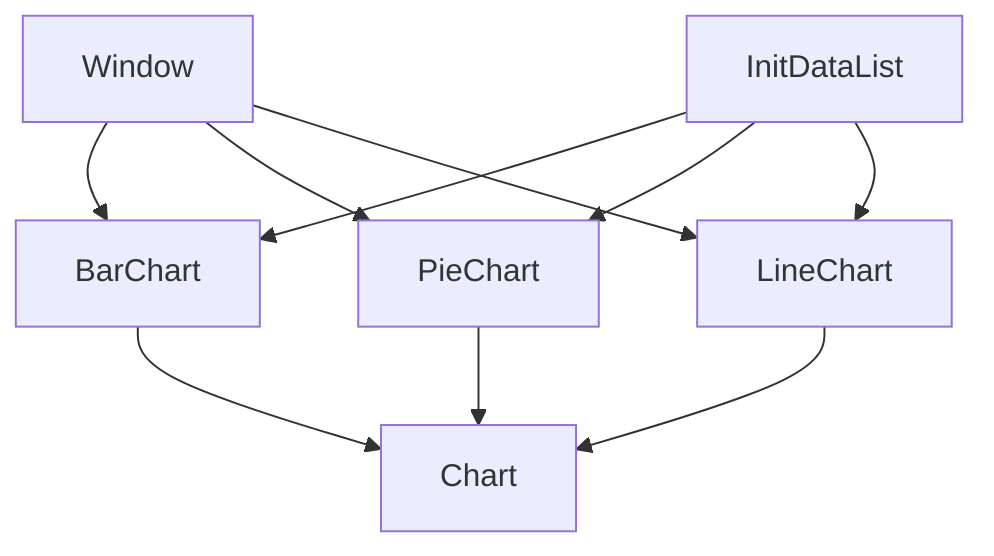

# Graph

Mini-Library for create chart.

# Requirement

- OpenCV

# Class Diagram

## To Do List

- [x] Dataset input will be taken
- [x] The dataset will be scaled for BarChart
- [x] Column bar will be drawn for BarChart
- [x] Column bar will be drawn for BarChart
- [x] Range(),median(), max() and min() will be written for InitDatalist.
- [ ] New class will be created => PieChart
- [ ] New class will be created => LineChart
